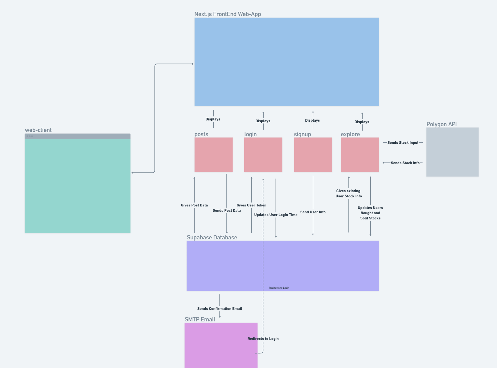
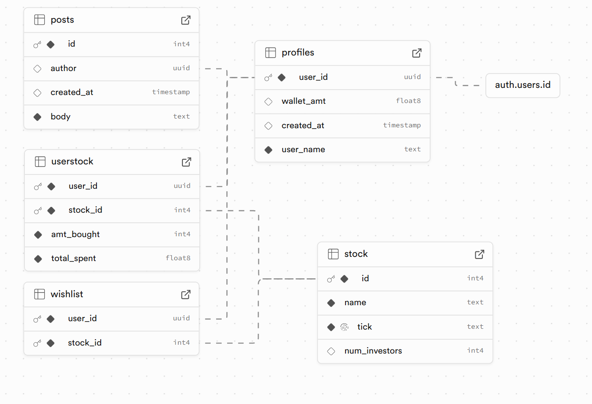
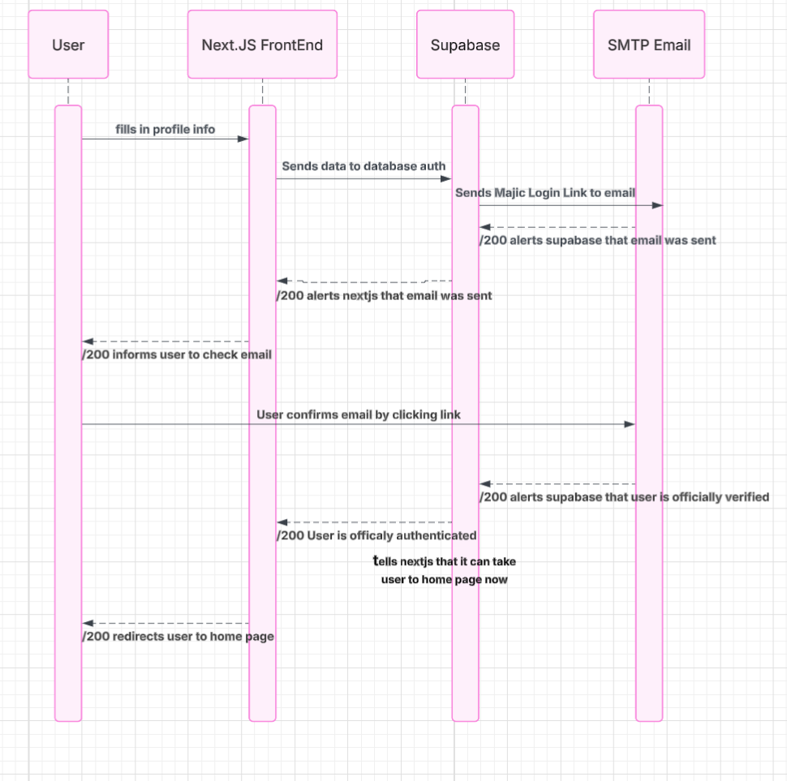

# Stockify Application Architecture

This document describes the overall architecture of the Stockify Application. 

## Highlevel Component Digram

## Explanation

Next.js is our front end. It was what our user sees and will be how the user interacts with the application. There are 4 routes for the user to go to (seen in red). These are /posts, /login, /signup, and /explore. These all relate back to next.js by display the info that they are getting to the user. Each route makes calls to the supabase database to either insert data to a table or retrieve data from a table. Minor differencies comes from the /signup route where the supabase database will send a confirmation link to the users email before allowing the user to be "official" and giving them permisions. Another difference is in the /explore route as it access the PolygonAPI to send and recieve stock info

## Entity Diagram

## Explanation
The profile is able to relate to their specified user by the user_id being a primary key refrencing the auth.users.id. Each post has their own specific id to make it easier to spot, but the author is a foreign key pointing to the users id (not user name since multiple people can have the same user name). So if someone makes an inapropriate post, we can ban the right person. The user stock refrences two other tables, the stock and profiles table. A user stock contained a user_id (foreign key from the user_id column in profiled) and a stock id (foreign key from the id column in the stock table). This way we can see the specific stock that a user bought. THe wishlist is the same idea, just without any amount bought or total spent columns. 

## Sign Up Sequence Diagram

## Explanation
User will fill in the form data displayed to them by the front end and submit. Upon recieving the data, nextjs will send a request to the supabase backend asking to put the user info in the auth table (making the user an official user). Upon reciving and making sure the data is suffiecent (has a valid email and password), supabase will send a magic login link to the user email. The SMTP email will alert supabase that it was delievered. Supabase will then tell next.js that the email was sent and delieverd. Next.js will tell the user that a verification email was sent, and for the user to go to their email and verify their account. The user will then go check their email and click on the magic login link. When the user clicks on it, they verify their email, thus verifying their account. This makes the SMTP email alert supabase that the user is verified. Upon recieving this information, supabase will now officially add the user to the auth table, and inform next.js that the user is now an officail user, they can now be redirected to the home page. Next.js recieves this message, and redirects the user to the home page. 